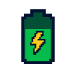

# BatteryCraft

<p align="center">
  
</p>

<p align="center">
  <strong>Your world. Less rendering load. More control.</strong><br>
  Automatic battery-aware profiles for Minecraft: Java Edition on MacBook.<br>
  Unplug to switch to lighter settings. Reconnect to restore your own.
</p>

<p align="center">
  <a href="https://github.com/benjamincalledur10-bit/BatteryCraft/releases/tag/v1.0.0-alpha.2"></a>
  <a href="https://github.com/benjamincalledur10-bit/BatteryCraft/releases"></a>
  <a href="https://modrinth.com/mod/batterycraft"></a>
  <a href="https://www.curseforge.com/minecraft/mc-mods/batterycraft"></a>
</p>

<p align="center">
  macOS · Fabric · Client-side only · MIT licensed
</p>

Download counters use a 48-hour cache and may lag behind the distribution pages.

## Download

Choose an official distribution page:

- [Modrinth](https://modrinth.com/mod/batterycraft) — published **1.0.0-beta.3**.
- [CurseForge](https://www.curseforge.com/minecraft/mc-mods/batterycraft) — published **1.0.0-beta.3**.
- [GitHub prerelease](https://github.com/benjamincalledur10-bit/BatteryCraft/releases/tag/v1.0.0-alpha.2) — **beta.4 preview**, with builds for all three Minecraft targets.

The GitHub preview uses the tag `v1.0.0-alpha.2`; its mod version and JAR names
are `1.0.0-beta.4`. BatteryCraft is currently in prerelease development.
Download the `.jar` matching your Minecraft version and keep it intact.

## Highlights

- **Automatic power profiles:** switch between plugged-in, battery, low-battery,
  and critical-battery settings as your power state changes.
- **Lighter rendering:** tune render and simulation distances, particles, clouds,
  entity shadows, biome blend, and entity distance alongside your FPS cap.
- **Smart Recovery:** protect your original settings on disk while a profile is
  active, so they can be restored even after an unexpected game shutdown.
- **Quiet by default in beta.4:** periodic battery messages start disabled. Enable
  them with your own interval in seconds or minutes, including 15 or 30 minutes.
- **Native video-settings pages:** with Sodium Config API, find BatteryCraft
  alongside the other mods in Video Settings. Edit profiles, notifications, and
  power mode, then use Apply to save everything.
- **Built for MacBook:** macOS battery detection, optional remaining-time
  estimates, and an experimental thermal-warning mode.
- **Local and private:** English/Spanish configuration, session statistics,
  diagnostics, and optional Sodium integration. No telemetry, Internet
  connection, or administrator privileges required by the mod.

## What's new in beta.4?

The new defaults prioritize lower rendering distances while allowing higher FPS
caps than beta.3:

| Power profile | FPS cap | Render distance | Simulation distance |
| --- | ---: | ---: | ---: |
| Plugged in | Your original setting | Your original setting | Your original setting |
| Battery | 120 | 8 chunks | 5 chunks |
| Low battery | 90 | 6 chunks | 4 chunks |
| Critical battery | 60 | 4 chunks | 3 chunks |

Low battery starts at **30%** and critical battery at **15%** by default. Both
thresholds and all profile values are configurable.

- Set an FPS cap to **0** to retain Minecraft's original FPS setting.
- Lighter original visual settings are respected rather than increased.
- Unchanged legacy profiles migrate to the new defaults; custom profiles remain.
- Periodic messages wait a full interval after being enabled or reconfigured.

These values are **caps, not guaranteed frame rates**. BatteryCraft adjusts game
settings; it does not replace Minecraft's renderer. Actual FPS and battery life
depend on hardware, resolution, shaders, world complexity, and other mods.
Higher FPS can increase power use. Beta.4 gains have not yet been benchmarked
in game. See [CHANGELOG.md](CHANGELOG.md) for the full history.

## Compatibility

| Component | Support |
| --- | --- |
| Operating system | macOS laptops with a battery |
| Game | Minecraft: Java Edition |
| Mod loader | Fabric Loader with Fabric API |
| Installation side | Client only; no server installation required |
| Optional integration | Sodium entity-distance adjustment |
| Interface languages | English and Spanish |

| Minecraft target | Required Java | Beta.4 preview file |
| --- | --- | --- |
| 1.21.x | Java 21 | `batterycraft-1.0.0-beta.4-mc1.21.jar` |
| 26.1.x | Java 25 | `batterycraft-1.0.0-beta.4-mc26.1.jar` |
| 26.2.x | Java 25 | `batterycraft-1.0.0-beta.4-mc26.2.jar` |

Previously tested combinations include Minecraft 1.21.11 with Keo Optimized,
26.1.2 with SodiumPlus, and 26.2 with Fabulously Optimized and Lumina shaders.
These are prior compatibility checks, not beta.4 performance benchmarks.

## Installation

1. Install Fabric Loader and Fabric API for your Minecraft version.
2. Download the matching BatteryCraft JAR from an official source above.
3. Place it in your Minecraft instance's `mods` folder. Do not extract it.
4. Remove any older BatteryCraft JAR from that instance to avoid duplicates.
5. Launch Minecraft and open **Options > Video Settings > BatteryCraft**
   with Sodium 0.8+ Config API installed.
6. Leave the mode on **Automatic** to switch profiles with your battery state.

## Configuration tips

With a compatible Sodium Config API, use **Esc > Options > Video Settings >
BatteryCraft**. The sidebar contains **General**, **Notifications**, **Battery**,
**Low battery**, and **Critical battery**. All settings stay inside Minecraft;
Sodium manages editing, cancellation, and **Apply**. The separate B/O key bindings
are not registered on this path.

For a 15-minute reminder, enable **Periodic battery message** under
**Notifications**, set **Message interval: minutes** to **15** and the extra
seconds to **0**, then click **Apply**. Use **30** for a half-hour interval.

This native integration is included in the `v1.0.0-alpha.2` GitHub preview;
the earlier `v1.0.0-alpha.1` JARs do not contain it. Without the Sodium Config API,
the older separate configuration window and shortcuts remain the fallback:


| Control | Default key |
| --- | --- |
| Open configuration | **O** |
| Cycle automatic, manual, and disabled modes | **B** |

Reassign or unbind these keys under **Options > Controls > Key Binds > BatteryCraft**.

- **Fewer interruptions:** leave periodic status messages off, or enable them
  and set the interval to **15** or **30** minutes. Profile-change
  notifications have their own toggle.
- **More FPS headroom:** raise the profile cap or use **0** to retain your
  Minecraft setting, then lower rendering distances to reduce workload.
- **Stronger battery savings:** choose a lower FPS cap as well as lighter visual
  settings. Maximum frame rate and minimum power use are different priorities.
- **Smoother power transitions:** adjust the transition delay to avoid rapid
  switching. Critical battery activates immediately.
- **After an upgrade:** review your profiles. Beta.4 disables beta.3's periodic
  message once during migration; you can enable it again whenever you want.

Configuration lives inside your Minecraft instance:

```text
config/batterycraft.json                 # Preferences and power profiles
config/batterycraft-recovery.properties  # Protected original settings
```

The recovery file is removed after successful restoration. Keep it in place
while a power-saving profile is active.

## Development

`main` contains the current beta.4 development snapshot. Published versions and
preview builds are listed under [GitHub Releases](https://github.com/benjamincalledur10-bit/BatteryCraft/releases).

Build and run the automated tests with the Gradle wrapper and a Java 21 toolchain:

```bash
./gradlew clean test releaseJars
```

The three target JARs are written to `build/libs/`. Automated checks cover
configuration migration, reminder timing, power profiles, battery-output
parsing, key bindings, and settings recovery. In-game testing is still needed
for compatibility, frame rate, and autonomy measurements.

## Feedback and support

Found a bug or have an idea? Open a [GitHub issue](https://github.com/benjamincalledur10-bit/BatteryCraft/issues).
Include your Mac model, macOS version, Minecraft version, Fabric Loader version,
BatteryCraft version, active profile, and relevant mods or shaders. Add logs and
steps to reproduce when available.

For performance reports, compare the same world, route, resolution, shaders,
and display brightness, and mention whether the charger was connected. FPS
observations and battery measurements help improve future profiles.

If BatteryCraft is useful to you, consider starring the repository or sharing
its official download page with another MacBook player.

## Credits and license

- **Main developer:** Benjiaa
- **License:** [MIT](LICENSE)

Explore another project by Benjiaa:
[Lumina Shader: Event Horizon](https://github.com/benjamincalledur10-bit/Lumina_Shader_Event_Horizon).
